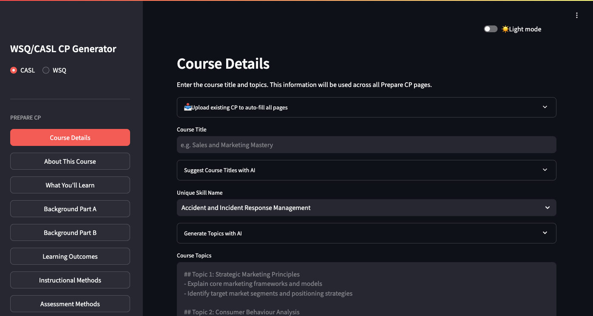

# WSQ and CASL Course Proposal (CP) Generator

A web application for preparing and submitting WSQ and CASL Course Proposal (CP) documents. Uses AI (Claude Agent SDK) to generate professional course content, build lesson plan schedules, import existing CP Excel files, and audit CP submissions against saved course details.

Built for training providers working with the WSQ and CASL (Course Accreditation and Standards for Learning) frameworks.



## Features

### Prepare CP (AI-Powered Content Generation)

Enter a course title and topics, then generate professional content for each CP section. All pages show prompt templates and inputs upfront — generation requires saved course details.

- **About This Course** -- Professional course description (80-120 words)
- **What You'll Learn** -- Bullet-point learning outcomes
- **Background Part A** -- Targeted sectors, audience, and training needs
- **Background Part B** -- Performance gaps, identification methods, and learner benefits
- **Learning Outcomes** -- One learning outcome per topic (T1/LO1 format)
- **Instructional Methods** -- Elaboration on appropriateness of each selected method
- **Assessment Methods** -- Elaboration on appropriateness of each selected assessment
- **LU Sequencing Rationale** -- Justification for Learning Unit sequencing using 5 curriculum frameworks (Step by Step, Simple to Complex, Part to Part, Part to Whole, Spiral)
- **Course Validation** -- 5 distinct survey response sets covering performance gaps and training needs for a chosen industry

### Submit CP

- **Course Outline** -- Topics, instructional methods, and duration per topic
- **Min Entry Requirements** -- Minimum entry requirements (knowledge, skills, attitude, experience) with optional special requirements
- **Job Roles** -- 10 relevant job roles following SSG Skills Framework naming
- **Lesson Plan** -- Two options: a deterministic **Simple Lesson Plan** (Time, Topics, Instructional Methods, Resources) with editable lesson/assessment hours (defaults to a one-day 7h lesson + 1h assessment), and an AI-generated lesson plan. Both downloadable as Word (.docx) and PDF (.pdf). The barrier algorithm keeps every day within 9:00 AM–6:00 PM (lunch, assessment, day-end splits), and PDF export is Unicode-safe (renders CJK and special characters)
- **CP Quality Audit** -- Upload CP Excel to compare against saved course details, highlights mismatches, and generates downloadable audit report (.docx)

### Import an Existing CP

On the Course Details page, **Upload an existing CP Excel file to auto-fill every page** in one step — course title, topics, durations, methods, About, What You'll Learn, Background A/B, and the instruction/assessment method elaborations and course outline. Minimum Entry Requirements and Job Roles (which aren't stored in the SSG CP template) are optionally AI-generated from the imported course details.

### Course Details

Configure course parameters used across all sections:

- CASL/WSQ mode selector with mode-specific fields (Unique Skill Name for CASL, TSC Reference Code/Title for WSQ)
- Course duration, number of topics, instructional/assessment hours
- CASL mode allows 0 assessment methods/duration
- Select instructional methods (19 options) and assessment methods (11 options)
- AI-powered course topic generation with configurable number of days, special requirements, and CASL skill description context
- AI-powered course title suggestions (20 SEO-friendly titles from a topic)
- Optional special requirements field for topic generation and min entry requirements
- Auto-calculated duration per topic, per method

### Interface

- One-click **dark / light theme toggle** (top-right), defaulting to dark
- Sidebar navigation grouped into Prepare CP and Submit CP sections

## Tech Stack

- **Python 3.13** with **uv** for package management
- **Streamlit** -- Interactive web UI with sidebar navigation
- **Claude Agent SDK** -- AI-powered content generation
- **openpyxl** -- Excel file parsing
- **python-docx** -- Word document generation
- **fpdf2** -- PDF document generation

## Getting Started

### Prerequisites

- Python 3.13+
- [uv](https://docs.astral.sh/uv/) package manager

### Install & Run

```bash
# Clone the repo
git clone https://github.com/alfredang/wsq-casl-cp-generator.git
cd wsq-casl-cp-generator

# Install dependencies
uv sync

# Run the app
uv run streamlit run streamlit_app.py
```

Open **http://localhost:8501** in your browser.

## Project Structure

```
wsq-casl-cp-generator/
├── streamlit_app.py                  # Streamlit web UI with sidebar navigation
├── app/
│   ├── ai_generator.py              # AI prompt templates & generation functions
│   ├── config.py                    # Excel cell reference mappings
│   ├── models.py                    # Pydantic data models
│   ├── extractor.py                 # Excel data extraction & CP import helpers
│   ├── simple_lesson_plan.py        # Deterministic lesson plan schedule builder
│   ├── generator_docx.py            # Course Document & Audit Report generation (.docx)
│   ├── generator_lesson_plan.py     # Lesson Plan generation (.docx)
│   └── generator_lesson_plan_pdf.py # Lesson Plan generation (.pdf, Unicode-safe)
├── .streamlit/
│   └── config.toml                  # Theme config (dark default)
├── .claude/
│   ├── commands/start-cp.md         # Claude Code skill to launch Streamlit
│   └── skills/                      # Claude Code skills for schedule & topic generation
├── pyproject.toml                   # Project config & dependencies
└── uv.lock                         # Locked dependencies
```

## License

MIT
